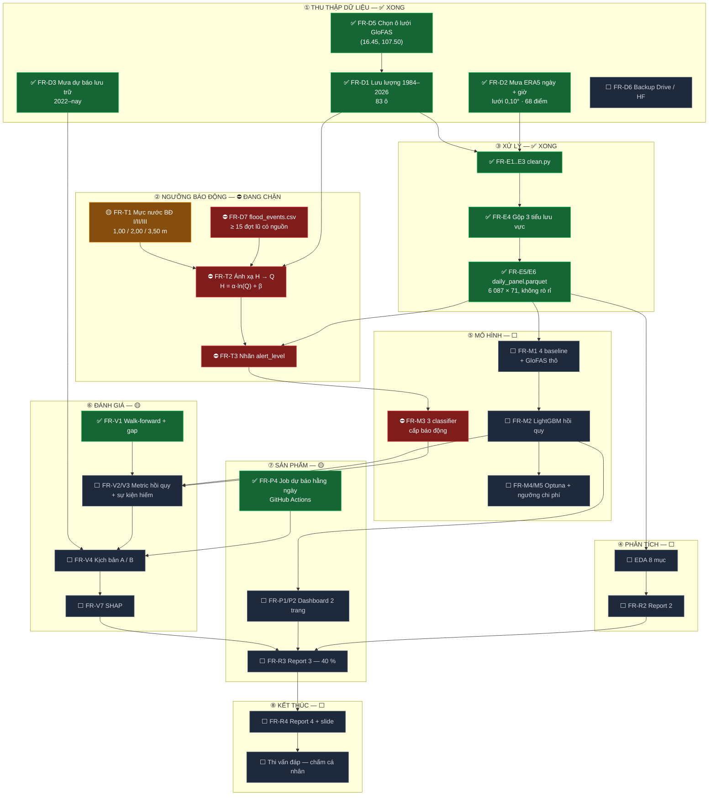

# FLOW TOÀN MÔN — từ dữ liệu thô tới điểm thi

**Cập nhật:** 15/09/2026 (cuối W1) · Ký hiệu: ✅ xong · 🟡 đang dở · ⛔ bị chặn · ⬜ chưa bắt đầu

---

## 1. Sơ đồ tổng thể



---

## 2. Bảng trạng thái chi tiết

### ① Thu thập dữ liệu — ✅ **hoàn tất**

| # | Việc | Trạng thái | Bằng chứng |
|---|---|---|---|
| FR-D5 | Chọn ô lưới GloFAS | ✅ | `(16.45, 107.50)`, 3 bằng chứng độc lập — `FINDINGS_GRID.md` |
| FR-D1 | Lưu lượng 1984–2026 | ✅ | 83 ô × 15 584 ngày |
| FR-D2 | Mưa ERA5 ngày + giờ | ✅ | 68 điểm lưới 0,10°; 2010–2026 ngày, 2015–2026 giờ |
| FR-D3 | Mưa dự báo lưu trữ | ✅ | 70 file, 2022-07 → nay |
| FR-D4 | Crawler chịu lỗi | ✅ | retry + cache + checkpoint + khoá chống chạy trùng |
| FR-D6 | Backup ra Drive / HF | ⬜ | **chưa làm** — dữ liệu mới chỉ nằm trên 1 máy |
| FR-D7 | `flood_events.csv` | ⛔ | 0/15 dòng — **nút thắt lớn nhất** |

### ② Ngưỡng báo động — ⛔ **đang chặn cả nhánh phân loại**

| # | Việc | Trạng thái | Ghi chú |
|---|---|---|---|
| FR-T1 | Mực nước BĐ I/II/III | 🟡 | Giá trị đã kiểm chứng chéo bằng 5 bản tin KTTV. Còn: dẫn nguồn gốc QĐ 05/2020/QĐ-TTg |
| FR-T2 | Ánh xạ H → Q | ⛔ | Chờ `FR-D7`. Thuật toán đã chốt ở `THRESHOLDS.md` §3 R2 |
| FR-T3 | Nhãn `alert_level` | ⛔ | Cột đã có trong panel nhưng **để trống** |
| FR-T4 | Kiểm chứng 3 đợt lũ | ⛔ | Chờ FR-T2 |

### ③ Xử lý dữ liệu — ✅ **hoàn tất**

| # | Việc | Trạng thái | Bằng chứng |
|---|---|---|---|
| FR-E1 | Múi giờ UTC → ICT | ✅ | test xanh |
| FR-E2 | Gộp giờ → ngày | ✅ | test xanh |
| FR-E3 | Bắt dữ liệu bất thường | ✅ | 4 test xanh; thực tế 0 % thiếu |
| FR-E4 | Gộp 3 tiểu lưu vực | ✅ | thượng 30 / trung 9 / hạ 29 điểm |
| FR-E5 | `daily_panel.parquet` | ✅ | 6 087 × 71, 2010–2026, 0 ngày trùng |
| FR-E6 | Lag không rò rỉ | ✅ | `test_no_leakage.py` xanh toàn bộ |

### ④ → ⑧ Phần còn lại — ⬜ **chưa bắt đầu**

| Giai đoạn | Việc chính | Phụ thuộc |
|---|---|---|
| ④ Phân tích | EDA 8 mục (`EDA_CHECKLIST.md`) · Report 2 | panel ✅ — **làm được ngay** |
| ⑤ Mô hình | 4 baseline · LightGBM hồi quy | panel ✅ — **làm được ngay** |
| | 3 classifier cấp báo động | ⛔ chờ `alert_level` |
| ⑥ Đánh giá | Metric hồi quy + sự kiện hiếm · kịch bản A/B · SHAP | chờ ⑤ |
| ⑦ Sản phẩm | Dashboard 2 trang · Report 3 (40 %) | chờ ⑥ |
| ⑧ Kết thúc | Report 4 · slide · thi vấn đáp | chờ ⑦ |

---

## 3. Đường găng hiện tại

```
⛔ FR-D7 flood_events.csv  ──►  FR-T2 ánh xạ H→Q  ──►  FR-T3 nhãn  ──►  FR-M3 classifier
                                                                            │
✅ daily_panel.parquet  ──►  EDA + baseline + LightGBM hồi quy  ────────────┤
                                                                            ▼
                                                                    Report 3 (40 %)
```

**Chỉ còn một nút thắt thật:** `flood_events.csv`. Nó chặn **toàn bộ nhánh phân loại cấp báo động** — tức câu hỏi nghiên cứu số 2, và là phần đặc thù nhất của đề tài.

Nhánh **hồi quy lưu lượng thì không bị chặn** — panel đã sẵn sàng, chạy baseline và LightGBM được ngay hôm nay.

---

## 4. Đối chiếu tiến độ với lịch 9 tuần

| Tuần | Kế hoạch | Thực tế |
|---|---|---|
| **W1** | Khởi động, bắt đầu crawl | ✅ **Vượt xa:** crawl xong toàn bộ, chọn xong ô lưới, ETL + panel xong, job hằng ngày đã chạy |
| **W2** | Report 1, crawl chạy nền | Còn: Report 1, literature review, `flood_events.csv` |
| **W3** | Dữ liệu xong + ngưỡng BĐ | Dữ liệu ✅ đã xong từ W1. Còn ngưỡng |
| W4 | EDA + Report 2 | làm được sớm hơn |
| W5–W6 | Mô hình + đánh giá | làm được sớm hơn |
| W7–W8 | SHAP, dashboard, Report 3 | |
| W9 | Report 4 + thi | |

Phần dữ liệu **đi trước kế hoạch khoảng 2 tuần**. Nhưng đừng coi đó là dư dả: phần ăn điểm nặng nhất (Report 3 — 40 %) vẫn ở phía trước, và `flood_events.csv` là việc **đọc–tra thủ công, không rút ngắn bằng máy được**.

---

## 5. Việc làm được ngay, không chờ ai

Vì panel đã xong, ba việc sau khởi động được lập tức:

1. **EDA 8 mục** theo `docs/EDA_CHECKLIST.md` → nội dung Report 2.
2. **4 baseline** (persistence · seasonal naive · ARIMA · **GloFAS thô**) → bảng so sánh đầu tiên.
3. **LightGBM hồi quy** h = 1/2/3, có GloFAS forecast làm feature → trả lời `AC-1` và `AC-3`.

Việc **chưa làm được**: mọi thứ liên quan cấp báo động (`FR-M3`, một phần `FR-V3`) — chờ `flood_events.csv`.

---

## 6. Rủi ro còn treo

| Rủi ro | Mức | Xử lý |
|---|---|---|
| `flood_events.csv` không đủ 10 đợt | 🔴 cao | Lùi về R4 (ngưỡng phân vị) và **đổi tên nhãn** thành "mức nguy cơ", không gọi là BĐ |
| Dữ liệu chỉ nằm trên 1 máy (FR-D6) | 🟠 | Backup Drive/HF — 10 phút, nên làm sớm |
| Đỉnh lũ bất thường 04/2022 (2 635 m³/s ngoài mùa lũ) | 🟡 | Kiểm khi EDA; nếu là lỗi dữ liệu thì ảnh hưởng phân vị và ngưỡng |
| Thi vấn đáp chấm cá nhân | 🟠 | `EXPLAINER.md` còn trống — bắt đầu viết từ W2 |
