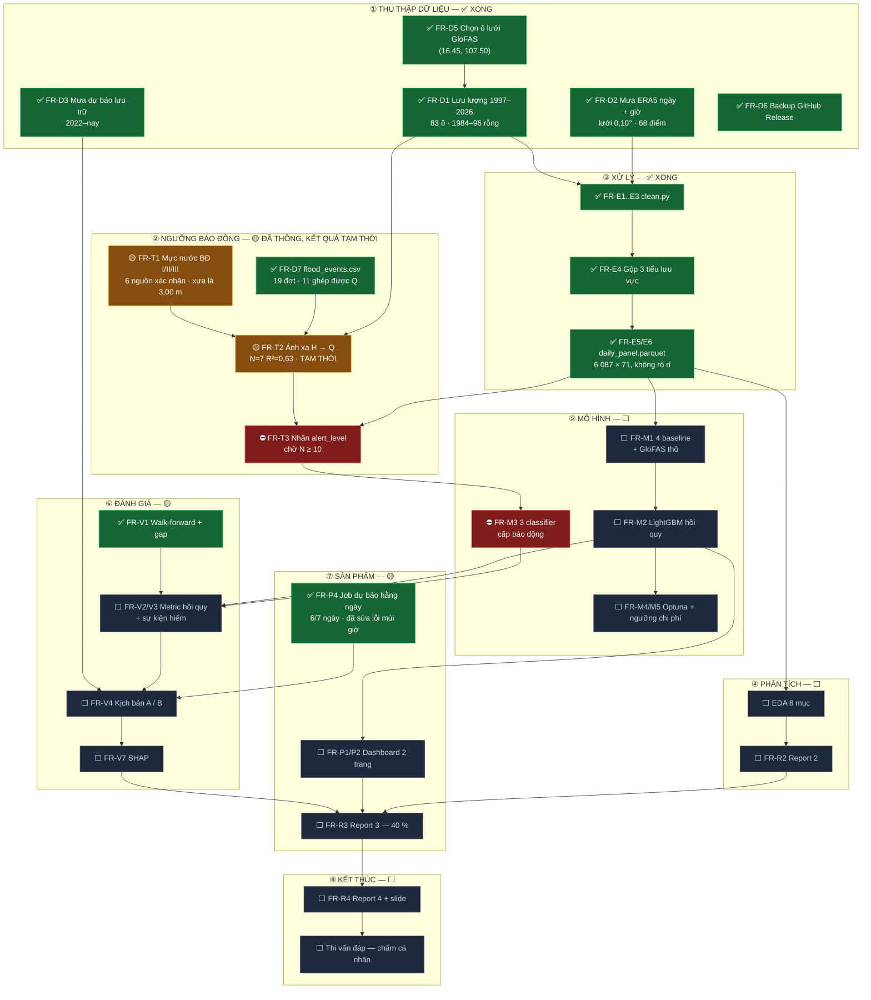

# FLOW TOÀN MÔN — từ dữ liệu thô tới điểm thi

**Cập nhật:** 21/09/2026 (hết W1) · Ký hiệu: ✅ xong · 🟡 đang dở · ⛔ bị chặn · ⬜ chưa bắt đầu

---

## 1. Sơ đồ tổng thể



---

## 2. Bảng trạng thái chi tiết

### ① Thu thập dữ liệu — ✅ **hoàn tất**

| # | Việc | Trạng thái | Bằng chứng |
|---|---|---|---|
| FR-D5 | Chọn ô lưới GloFAS | ✅ | `(16.45, 107.50)`, 3 bằng chứng độc lập — `FINDINGS_GRID.md` |
| FR-D1 | Lưu lượng | ✅ | 83 ô × 15 584 dòng, nhưng **chỉ 10 835 ngày có dữ liệu (1997–2026)**; 1984–1996 rỗng 100 % — `FINDINGS_EVENTS.md` §3 |
| FR-D2 | Mưa ERA5 ngày + giờ | ✅ | 68 điểm lưới 0,10°; 2010–2026 ngày, 2015–2026 giờ |
| FR-D3 | Mưa dự báo lưu trữ | ✅ | 70 file, 2022-07 → nay |
| FR-D4 | Crawler chịu lỗi | ✅ | retry + cache + checkpoint + khoá chống chạy trùng |
| FR-D6 | Backup ra ngoài máy | ✅ | Release `data-2026-09-17`, 9 asset 95 MB, đã kiểm khôi phục bit-for-bit |
| FR-D7 | `flood_events.csv` | ✅ | **19 sự kiện** có nguồn + trích nguyên văn. Nhưng chỉ 11 ghép được lưu lượng, 7 ở tập hiệu chuẩn chính — `FINDINGS_EVENTS.md` |

### ② Ngưỡng báo động — ⛔ **đang chặn cả nhánh phân loại**

| # | Việc | Trạng thái | Ghi chú |
|---|---|---|---|
| FR-T1 | Mực nước BĐ I/II/III | 🟡 | 6 nguồn độc lập xác nhận 1,00 / 2,00 / 3,50 m. **Phát hiện: BĐ III xưa là 3,00 m.** Còn: dẫn Phụ lục QĐ 05/2020/QĐ-TTg |
| FR-T2 | Ánh xạ H → Q | 🟡 | Đã chạy: `H = 2,86·ln(Q) − 17,97`, N=7, R²=0,629. `Q_BĐ3` = 1 823 m³/s ±20 %. **Tạm thời** vì N < 10 |
| FR-T3 | Nhãn `alert_level` | ⛔ | Chờ FR-T2 hết tạm thời. `cfg.ALERT_LEVELS_Q` để trống **có chủ ý** |
| FR-T4 | Kiểm chứng 3 đợt lũ | 🔴 | Đã thử trên 5 đợt: chệch **−1,94 m** một chiều. Xem R21 |

### ③ Xử lý dữ liệu — ✅ **hoàn tất**

| # | Việc | Trạng thái | Bằng chứng |
|---|---|---|---|
| FR-E1 | Múi giờ UTC → ICT | ✅ | test xanh |
| FR-E2 | Gộp giờ → ngày | ✅ | test xanh |
| FR-E3 | Bắt dữ liệu bất thường | ✅ | 4 test xanh; thực tế 0 % thiếu |
| FR-E4 | Gộp 3 tiểu lưu vực | ✅ | thượng 30 / trung 9 / hạ 29 điểm |
| FR-E5 | `daily_panel.parquet` | ✅ | 6 087 × 71, 2010–2026, 0 ngày trùng |
| FR-E6 | Lag không rò rỉ | ✅ | `test_no_leakage.py` xanh toàn bộ |

### ④ → ⑧ Phần còn lại — ⬜ **chưa bắt đầu**

| Giai đoạn | Việc chính | Phụ thuộc |
|---|---|---|
| ④ Phân tích | EDA 8 mục (`EDA_CHECKLIST.md`) · Report 2 | panel ✅ — **làm được ngay** |
| ⑤ Mô hình | 4 baseline · LightGBM hồi quy | panel ✅ — **làm được ngay** |
| | 3 classifier cấp báo động | ⛔ chờ `alert_level` |
| ⑥ Đánh giá | Metric hồi quy + sự kiện hiếm · kịch bản A/B · SHAP | chờ ⑤ |
| ⑦ Sản phẩm | Dashboard 2 trang · Report 3 (40 %) | chờ ⑥ |
| ⑧ Kết thúc | Report 4 · slide · thi vấn đáp | chờ ⑦ |

---

## 3. Đường găng hiện tại

```
✅ FR-D7 (19 đợt)  ──►  🟡 FR-T2 (N=7, tạm thời)  ──►  ⛔ FR-T3 nhãn  ──►  FR-M3 classifier
                              ▲
                    cần ≥3 đợt 2010–2022 nữa
                                                                            │
✅ daily_panel.parquet  ──►  EDA + baseline + LightGBM hồi quy  ────────────┤
                                                                            ▼
                                                                    Report 3 (40 %)
```

**Nút thắt đã đổi.** `flood_events.csv` xong (19 sự kiện), nhưng ánh xạ H→Q chỉ đứng trên **7 cặp** nên còn tạm thời. Nút thắt mới, nặng hơn: **chuỗi GloFAS sau mốc gãy 2022-07-01 có thể lệch biên độ** (R21) — nếu đúng thì ảnh hưởng cả nhánh hồi quy, không riêng nhánh phân loại.

Nhánh **hồi quy lưu lượng thì không bị chặn** — panel đã sẵn sàng, chạy baseline và LightGBM được ngay hôm nay.

---

## 4. Đối chiếu tiến độ với lịch 9 tuần

| Tuần | Kế hoạch | Thực tế |
|---|---|---|
| **W1** | Khởi động, bắt đầu crawl | ✅ **Vượt xa:** crawl xong toàn bộ, chọn xong ô lưới, ETL + panel xong, backup Release, job hằng ngày chạy 6/7 ngày, Report 1 (PDF IEEE + slide + script) xong sớm. Còn nợ: `flood_events.csv` |
| **W2** | Report 1, crawl chạy nền | Report 1 ✅ xong từ W1 (nộp nội bộ 26/09). Còn: `flood_events.csv`, literature review, FR-T1 dẫn nguồn gốc |
| **W3** | Dữ liệu xong + ngưỡng BĐ | Dữ liệu ✅ đã xong từ W1. Còn ngưỡng |
| W4 | EDA + Report 2 | làm được sớm hơn |
| W5–W6 | Mô hình + đánh giá | làm được sớm hơn |
| W7–W8 | SHAP, dashboard, Report 3 | |
| W9 | Report 4 + thi | |

Phần dữ liệu **đi trước kế hoạch khoảng 2 tuần**. Nhưng đừng coi đó là dư dả: phần ăn điểm nặng nhất (Report 3 — 40 %) vẫn ở phía trước, và `flood_events.csv` là việc **đọc–tra thủ công, không rút ngắn bằng máy được**.

---

## 5. Việc làm được ngay, không chờ ai

Vì panel đã xong, ba việc sau khởi động được lập tức:

1. **EDA 8 mục** theo `docs/EDA_CHECKLIST.md` → nội dung Report 2.
2. **4 baseline** (persistence · seasonal naive · ARIMA · **GloFAS thô**) → bảng so sánh đầu tiên.
3. **LightGBM hồi quy** h = 1/2/3, có GloFAS forecast làm feature → trả lời `AC-1` và `AC-3`.

Việc **chưa làm được**: mọi thứ liên quan cấp báo động (`FR-M3`, một phần `FR-V3`) — chờ `flood_events.csv`.

---

## 6. Rủi ro còn treo

| Rủi ro | Mức | Xử lý |
|---|---|---|
| `flood_events.csv` không đủ 10 đợt | 🔴 cao | Lùi về R4 (ngưỡng phân vị) và **đổi tên nhãn** thành "mức nguy cơ", không gọi là BĐ |
| ~~Dữ liệu chỉ nằm trên 1 máy~~ | ✅ | Đã sao lưu lên GitHub Release, khôi phục bằng `scripts/restore_data.py` |
| Đỉnh lũ bất thường 04/2022 (2 635 m³/s ngoài mùa lũ) | 🟡 | Kiểm khi EDA; nếu là lỗi dữ liệu thì ảnh hưởng phân vị và ngưỡng |
| Thi vấn đáp chấm cá nhân | 🟠 | `EXPLAINER.md` còn trống — bắt đầu viết từ W2 |
| ~~Job xanh mà vẫn mất dữ liệu~~ | ✅ | Mất bản dự báo 20/09 dù Actions báo xanh 6 lần. Nguyên nhân: `date.today()` đọc ngày UTC. Đã sửa, đã khoá bằng test + `scripts/check_forecast_log.py` chạy ngay trong job |

---

## 7. Sự cố đã xử lý ở W1 — ghi lại để không lặp

| Sự cố | Cái đắt nhất phải nhớ |
|---|---|
| Toạ độ ô lưới trong kế hoạch gốc sai (5,7 vs 308 m³/s) | Số liệu phải kiểm bằng vật lý (suy diện tích lưu vực), không tin toạ độ có sẵn |
| Cơn 429 tưởng là hạn mức API, đã cắt scope oan | `pkill` từ Git Bash không giết được process Python trên Windows — 3 crawler tự cạnh tranh nhau. Đã khôi phục scope, thêm khoá chống chạy trùng |
| `persistence` đạt NSE 0,542 ở h=1, vượt ngưỡng nghiệm thu cũ | Đặt ngưỡng nghiệm thu **trước** khi đo baseline là sai thứ tự. Đã nâng lên 0,70 / 0,40 / 0,25 |
| Không có kho dự báo GloFAS quá khứ (404) | Mất `AC-3` và cả lập luận phòng vệ của R9. Cơ hội thật nằm ở h=2, h=3 |
| Mất bản dự báo 20/09 dù job xanh 6 lần | **Job xanh không chứng minh dữ liệu đúng.** Kiểm phải nhắm vào sản phẩm. Xem `reports/forecast_log/README.md` |
